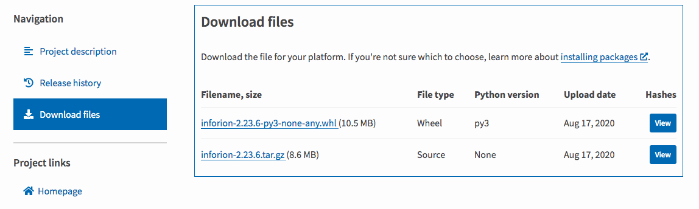

==============
Installation
==============

There are two ways that one can install Python3 Application: InforION. If you follow the steps below, you should have installed everything in no time. 

Install from Package Managers
-------------------------------

First of all, you can install InforION from *Package Managers*, which is available as a package on PyPI: https://pypi.org/project/inforion/.

But, nevertheless, often the preferred way to install it is simply through **pip** in your *Terminal* (MacOS) or *Command Prompt* (Windows):
::

    pip3 install inforion

Build from Source
-------------------

Another easy way, is that Inforion may also be consumed and built directly from source. For this kind of installation we recommend the use of **Visual Studio Code** and opening its inside Terminal, so following these steps below wont be a problem.
::

    git clone https://github.com/Fellow-Consulting-AG/inforion.git

As soon as you are inside os the new inforion directory, just run the following command:
::

    make install

Install in 2 minutes
====================

https://asciinema.org/a/347875.svg

|asciimema| 

.. |asciimema| image:: https://asciinema.org/a/347875.svg
                   :target: https://asciinema.org/a/347875

