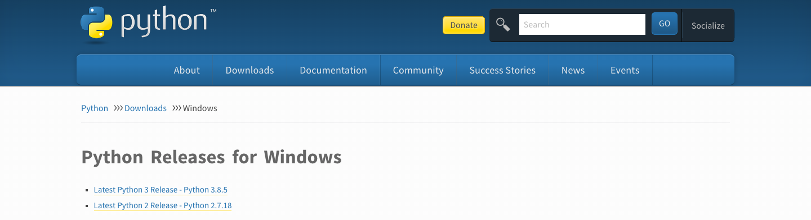
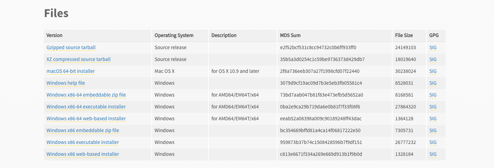

===========================
Python Download for Windows
===========================

In this guide we are going to show you how to install **Python** 3.7 or higher for your Windows.

Python 3 Installer Download
---------------------------

**1.** In order to install Python, you must download it from this URL, but it is very important that you select or use at least **Python 3.7 or higher**:
`Python Releases for Windows <https://www.python.org/downloads/windows/>`__

**2.** Then, scroll down and select **x86–64 executable installer** for Windows 10–64 bit computer or **Windows x86 executable installer** for 32-bit.

Run the Installer
-----------------

Once you have downloaded an installer, simply run it by double-clicking on the downloaded file. A pop-up window should appear that looks like the following one:

**3.** Prior installing Python, please select the option: **Add Python 3.8 to PATH**

.. image:: image/python.png
    :width: 500
    :align: center

**4.** After Setup was successful select: **Disable path length limit**

.. image:: image/python2.png
    :width: 500
    :align: center

===
PIP
===

Pip is a de facto standard package-management system used to install and manage software packages written in Python.
Many packages can be found in the default source for packages and their dependencies — Python Package Index (PyPI).

Installation
------------
::

    pip3 install inforion

Upgrade
-------

If you want to upgrade the inforion, please use:
::

    pip install inforion --upgrade

Show Version
------------

If you want to see the version you have installed, please use:
::

    pip show inforion 

==============================
Jupyter Notebook to Windows 10
==============================

The last prerequisite is to install **Jupyter Notebook** using the following command:
::

    python -m pip install jupyter

.. image:: image/1_US6AcX4AHQ9czzf5oJHfxg.png

To run Jupyter Notebook it is necessary that you use and command: 
::

    jupyter notebook

.. image:: image/1_CcrLTITT6NXte-Mgqh1AaQ.png

Finally, start the notebook server and popup dashboard in browser using **“localhost:8888/tree”** url and now you will get access to the Jupyter Notebook.

.. image:: image/1_VNqiduT87Z-T-k70m12yCQ.png

